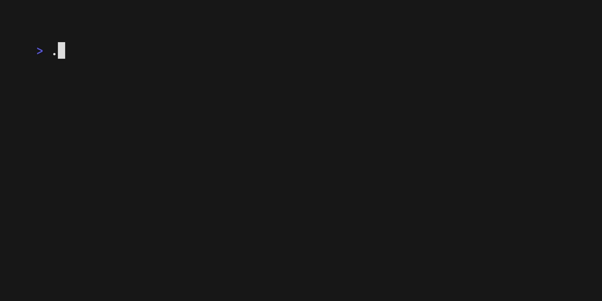

# Log

<p>
  
  
  <br>
  <a href="https://github.com/charmbracelet/log/releases"></a>
  <a href="https://pkg.go.dev/github.com/charmbracelet/log?tab=doc"></a>
  <a href="https://github.com/charmbracelet/log/actions"></a>
</p>

A minimal and colorful Go logging library. 🪵



It provides a leveled structured human readable logger with a small API. Unlike
[standard `log`][stdlog], the Charm logger provides customizable colorful human
readable logging with batteries included.

- Uses [Lip Gloss][lipgloss] to style and colorize the output.
- Colorful, human readable format.
- Ability to customize the time stamp format.
- Skips caller frames and marks function as helpers.
- Leveled logging.
- Text, JSON, and Logfmt formatters.
- Store and retrieve logger in and from context.
- Standard log adapter.

## Usage

Use `go get` to download the dependency, and then `import` it in your Go files:

```bash
go get github.com/charmbracelet/log@latest
```

```go
import "github.com/charmbracelet/log"
```

The Charm logger comes with a global package-wise logger with timestamps turned
on, and the logging level set to `info`.

```go
log.Debug("Cookie 🍪") // won't print anything
log.Info("Hello World!")
```


All logging levels accept optional key/value pairs to be printed along with a
message.

```go
err := fmt.Errorf("too much sugar")
log.Error("failed to bake cookies", "err", err)
```


You can use `log.Print()` to print messages without a level prefix.

```go
log.Print("Baking 101")
// 2023/01/04 10:04:06 Baking 101
```

### New loggers

Use `New()` to create new loggers.

```go
logger := log.New()
if butter {
    logger.Warn("chewy!", "butter", true)
}
```


### Options

You can customize the logger with options. Use `log.WithCaller()` to enable
printing source location. `log.WithTimestamp()` prints the timestamp of each
log.

```go
logger := log.New(log.WithTimestamp(), log.WithTimeFormat(time.Kitchen),
    log.WithCaller(), log.WithPrefix("Baking 🍪 "))
logger.Info("Starting oven!", "degree", 375)
time.Sleep(10 * time.Minute)
logger.Info("Finished baking")
```


Use `log.SetFormatter()` or `log.WithFormatter()` to change the output format.
Available options are:

- `log.TextFormatter` (_default_)
- `log.JSONFormatter`
- `log.LogfmtFormatter`

> **Note** styling only affects the `TextFormatter`. Styling is disabled if the
> output is not a TTY.

For a list of available options, refer to [options.go](./options.go).

Set the logger level and options.

```go
logger.SetReportTimestamp(false)
logger.SetReportCaller(false)
logger.SetLevel(log.DebugLevel)
logger.Debug("Preparing batch 2...")
```

### Sub-logger

Create sub-loggers with their specific fields.

```go
batch2 := logger.With("batch", 2, "chocolateChips", true)
batch2.Debug("Adding chocolate chips")
```


### Format Messages

You can use `fmt.Sprintf()` to format messages.

```go
for item := 1; i <= 100; i++ {
    log.Info(fmt.Sprintf("Baking %d/100...", item))
}
```


Or arguments:

```go
for temp := 375; temp <= 400; temp++ {
    log.Info("Increasing temperature", "degree", fmt.Sprintf("%d°F", temp))
}
```


### Helper Functions

Skip caller frames in helper functions. Similar to what you can do with
`testing.TB().Helper()`.

```go
function startOven(degree int) {
    log.Helper()
    log.Info("Starting oven", "degree", degree)
}

log.SetReportCaller(true)
startOven(400) // INFO <cookies/oven.go:123> Starting oven degree=400
```


This will use the _caller_ function (`startOven`) line number instead of the
logging function (`log.Info`) to report the source location.

### Standard Log Adapter

Some Go libraries, especially the ones in the standard library, will only accept
the [standard logger][stdlog] interface. For instance, the HTTP Server from
`net/http` will only take a `*log.Logger` for its `ErrorLog` field.

For this, you can use the standard log adapter, which simply wraps the logger in
a `*log.Logger` interface.

```go
stdlog := log.New(log.WithPrefix("http")).StandardLog(log.StandardLogOption{
    ForceLevel: log.ErrorLevel,
})
s := &http.Server{
    Addr:     ":8080",
    Handler:  handler,
    ErrorLog: stdlog,
}
stdlog.Printf("Failed to make bake request, %s", fmt.Errorf("temperature is too low"))
// ERROR http: Failed to make bake request, temperature is too low
```

[lipgloss]: https://github.com/charmbracelet/lipgloss
[stdlog]: https://pkg.go.dev/log

## License

[MIT](https://github.com/charmbracelet/log/raw/master/LICENSE)

---

Part of [Charm](https://charm.sh).

<a href="https://charm.sh/"></a>

Charm热爱开源 • Charm loves open source • نحنُ نحب المصادر المفتوحة
